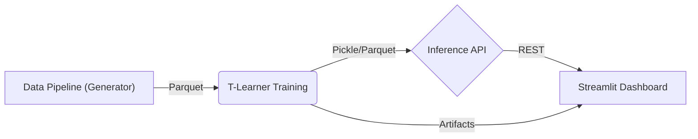

# Causal Uplift & Policy Optimization Engine

A production-grade Causal Inference system designed to optimize marketing ROI by identifying **who to target** (Persuadables) and **who to avoid** (Sleeping Dogs).


---

## 🚀 The Business Problem
Traditional Churn/Propensity models answer: *"Who is likely to buy?"*  
**Causal Uplift Logic** answers: *"Who will buy **only if** we intervene?"*

By targeting customers based on **propensity**, companies waste millions on:
1.  **Sure Things:** Loyal customers who would have bought anyway (Subsidy Cost).
2.  **Sleeping Dogs:** Customers who react *negatively* to marketing (Churn Cost).
3.  **Lost Causes:** Customers who will never buy (Efficiency Cost).

### The Solution: "The Hard Market"
This engine simulates a realistic, difficult market environment where **75% of customers are 'Neutral'** (ignore ads). A traditional model fails here. Our T-Learner identifies the **14.4% Persuadable Segment** (the "Needle in the Haystack"), delivering massive efficiency gains.

---

## 📊 Key Results
Based on a 1,000,000-user validation set:

| Metric | Result | Context |
| :--- | :--- | :--- |
| **Global Lift** | **3.2x** | Improvement over random targeting. |
| **Cost Savings** | **~86%** | Savings by ignoring "Neutrals" & "Sleeping Dogs". |
| **Persuadable Segment** | **14.4%** | The actual targetable audience (Pre-filtered). |
| **Strategy** | **Avoid Negative Lift** | Explicitly excludes the 10% "Sleeping Dog" segment. |

> *"Targeting everyone costs $10M. Targeting only Persuadables costs $1.4M for similar returns."*

---

## 🏗️ Architecture

The system assumes a modern microservices architecture, running entirely in Docker.



### Tech Stack
*   **Model**: T-Learner (Meta-Learner) using `XGBoost` base learners.
*   **API**: `FastAPI` for real-time CATE (Conditional Average Treatment Effect) inference.
*   **Dashboard**: `Streamlit` for policy simulation and interactive ROI analysis.
*   **Environment**: `uv` for dependency management, `Docker Compose` for orchestration.

---

## � Deployment

This project supports **two deployment modes** to demonstrate both cloud-ready and production-scale architectures.

### Option 1: Single-Container (Hugging Face Spaces / Cloud Run)

A monolithic container running both API and Dashboard. Ideal for demos and single-instance cloud deployments.

```bash
docker build -t causal-uplift-engine .
docker run -p 7860:7860 causal-uplift-engine
```

**Access:**
- **Dashboard:** [http://localhost:7860](http://localhost:7860)

> **Live Demo:** [Hugging Face Spaces](https://huggingface.co/spaces/govind104/causal-uplift-engine)

---

### Option 2: Microservices (Local Development / Production)

Separate containers for API and Dashboard, orchestrated via Docker Compose. Ideal for local development and production-scale deployments.

```bash
docker-compose up --build
```

**Access:**
- **Dashboard:** [http://localhost:8501](http://localhost:8501)
- **API Docs:** [http://localhost:8000/docs](http://localhost:8000/docs)

---

## 📂 Project Structure

```text
src/
├── api/                 # FastAPI Service
│   ├── main.py          # Endpoints (Predict, Optimize)
│   └── schemas.py       # Pydantic Models
├── dashboard/           # Streamlit App
│   └── app.py           # Interactive UI & Plotly Viz
├── data/                # Data Pipeline
│   └── generator.py     # Quantile-Based Synthetic Generator
├── models/              # Causal Models
│   └── t_learner.py     # T-Learner Class & Training Script
└── visualization/       # Shared Plotting Utils
```

---

## 🔬 Methodology: T-Learner
We use a **Two-Model (T-Learner)** approach to estimate CATE:
1.  **$\mu_1(x)$**: Estimates probability of conversion *with* treatment.
2.  **$\mu_0(x)$**: Estimates probability of conversion *without* treatment.
3.  **CATE**: $\tau(x) = \mu_1(x) - \mu_0(x)$

### Behavior-Based Segmentation
Instead of arbitrary deciles, we segment users based on strict lift thresholds:
*   🟢 **Persuadable** ($\tau > 0.05$): Strong positive reaction. **Target.**
*   🔴 **Sleeping Dog** ($\tau < -0.05$): Strong negative reaction. **Avoid.**
*   ⚪ **Neutral** ($-0.05 \le \tau \le 0.05$): No significant reaction. **Ignore.**

---

## 📚 References & Inspiration

This project implements modern Uplift Modeling techniques inspired by the following open-source research and implementations:

* **Criteo Uplift Modelling** (Hugh Huyton): Inspiration for the "Treatment vs. Control" visual analysis techniques.
    * [Link to Kaggle Notebook](https://www.kaggle.com/code/hughhuyton/criteo-uplift-modelling)
* **Qini Curve Implementation** (Davin Wijaya): Reference for the manual calculation of Area Under Qini Curve (AUQC).
    * [Link to Kaggle Notebook](https://www.kaggle.com/code/davinwijaya/uplift-modeling-qini-curve-with-python)
* **RetailHero Uplift** (Maksim Shevchenko): Guided the logic for multi-class segmentation (Persuadables vs. Sleeping Dogs).
    * [Link to GitHub](https://github.com/maks-sh/scikit-uplift/blob/master/notebooks/RetailHero_EN.ipynb)
* **Marketing Uplift Demo** (Mai Anh Dang): Provided context for "ROI-based" optimization strategies in retail.
    * [Link to Kaggle Notebook](https://www.kaggle.com/code/maianhdang/demo-uplift-modeling-in-marketing)

---

## 🛡️ License
MIT License. Free for educational and portfolio use.
